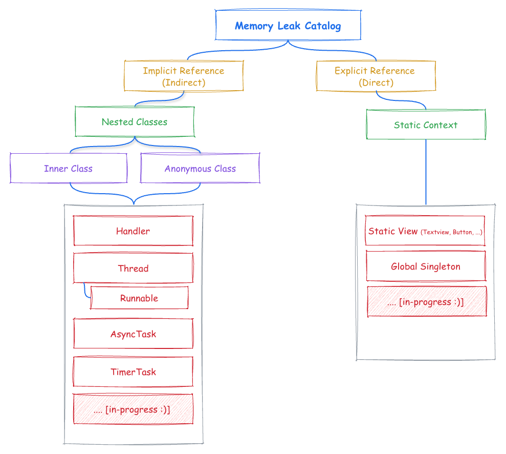

  

  
  

   

<!--
  
  
  
  

   
  -->
  
  
  

  <!-- 

  
  
  
  
   

  
  
  
  

-->

# Memory leak catalog
MemoryLeakCatalog is a hands-on learning project designed to help Android developers understand, reproduce, and fix memory leaks in Kotlin, Jetpack Compose, and classic Android views.

Use it for:
 - Improving your Android expertise
 - Interview preparation
 - Teaching junior developers
 - Debugging patterns you see in production apps

## Memory leak
A memory leak occurs when an application keeps holding on to memory that is no longer needed, causing the device to run out of memory.
The heap is a region of memory in which objects are allocated during the runtime of an Android application, and an out-of-memory error happens when there is not enough heap space available on the device.

Directly or indirectly referencing objects can cause memory leaks.

## Implicit Reference (Indirect)
An implicit, or indirect, reference occurs when an object holds a reference to another object that it doesn't explicitly declare. These types of leaks can be difficult to diagnose and fix because the problematic reference is not immediately obvious in the code.

### Nested Class
A nested class is a class defined within another class. In Android, nested classes are commonly used for custom views, adapters, or listener interface implementations for UI components.

Nested classes can cause memory leaks if they implicitly hold a reference to their outer (parent) class, preventing the parent class from being garbage collected when it's no longer needed.

There are four types of nested classes in Java/Kotlin:
1.  **Static Nested Classes:** Do not hold an implicit reference to the outer class.
2.  **Non-Static Nested Classes (Inner Classes):** Hold an implicit reference to the outer class.
3.  **Local Classes:** (Defined inside a method) Behave like inner classes if non-static.
4.  **Anonymous Classes:** A form of inner class without a name.

In Android development, **Inner Classes** and **Anonymous Classes** are frequent sources of memory leaks.

#### Common Leak Scenarios with Nested Classes:
* [Inner Classes](/docs/InnerClasses.md)
* [Anonymous classes](/docs/AnonymousClass.md)

Under nested classes (Inner or Anonymous) there are multiple cases
* [Handler.md](docs/Handler.md)
* [Thread](docs/Thread.md)
  * [Runnable](docs/Thread.md)
* [AsyncTask.md](docs/AsyncTask.md)
* [TimerTask.md](docs/TimerTask.md)
* TODO....

## Explicit Reference (Direct)
An explicit reference occurs when an object directly holds a reference to another object, preventing it from being garbage collected even after its intended lifecycle has ended. While the reference is clearly visible in the code, its potential to cause a memory leak might be overlooked.

This typically happens when a **long-lived object** (like a singleton or a static field) holds a strong reference to a **short-lived object** with a more limited scope (like an Activity, Fragment, View, or Context).

#### Common Leak Scenarios with Static Contexts:
* [StaticView.md](docs/StaticView.md)
* [GlobalSingleton.md](docs/GlobalSingleton.md)
* TODO....
