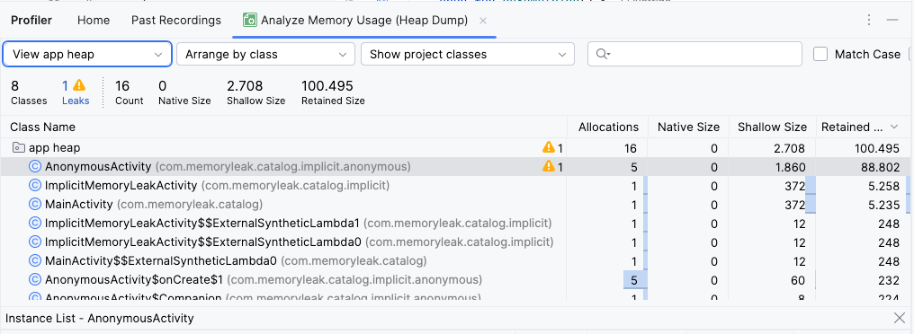

## Anonymous Class
An unnamed class defined within a method. The syntax of an anonymous class expression is like the invocation of a constructor, except that there is a class definition contained in a block of code.

Anonymous classes help make code more concise and reduce boilerplate, since you can declare and create the class at the same time.

They are commonly used to quickly implement interfaces, override methods, or define short-lived event handlers without creating a separate named class.
**Interface**
```kotlin
    // Using an object expression
    val anonymousInterface = object : Runnable {
        override fun run() {
                //...
            }
    }
    
    //OR A functional interface can be implemented with a lambda
    val anonymousInterface = Runnable { /*...*/ }
```

**Class**

```kotlin
    val mObject = object : MyAnonymousClass() { 
        override fun doSomething() {
            //...
        } 
    }
```

### Memory leak
A memory leak can occur because an anonymous class, as an inner class, holds an implicit reference to its outer class (in this case, `AnonymousActivity`). If this anonymous object is then stored in a `static` reference (`companion object`), it will live for the entire application lifecycle. This prevents the `Activity` from ever being garbage collected, even after it has been destroyed.

**Example**
In this example, `anonymousObject` is stored in a `companion object`, making it static. The anonymous object holds a reference to `AnonymousActivity`, causing a memory leak when the activity is destroyed (e.g., on screen rotation).

```kotlin
    class AnonymousActivity : AppCompatActivity() {
        override fun onCreate(savedInstanceState: Bundle?) {
            super.onCreate(savedInstanceState)
            setContentView(R.layout.activity_anonymous)
          
          // The anonymous class implicitly holds a reference to AnonymousActivity.
          // Because 'anonymousObject' is static, this reference will never be released.
          anonymousObject = object : MyAnonymousClass() {
                override fun doSomething() {
                    // This makes the reference explicit, but the leak exists even without this line.
                    this@AnonymousActivity
                }
            }
        }
    
        companion object {
            // A static reference to the anonymous object causes the leak.
            private lateinit var anonymousObject: MyAnonymousClass
        }
    }
    
    open class MyAnonymousClass {
        open fun doSomething() {
        }
    }
```

* Run the app and rotate the device (which destroys and recreates the Activity).
* Then check for a memory leak using the Android Studio Profiler.




### To fix this Memory leak you need to use WeakReference
Wrap `MyAnonymousClass` with WeakReference, as anonymous classes don't have explicit names or variable references.

```kotlin
class AnonymousActivity : AppCompatActivity() {
    override fun onCreate(savedInstanceState: Bundle?) {
        super.onCreate(savedInstanceState)
        setContentView(R.layout.activity_anonymous)

        anonymousObject = WeakReference(object : MyAnonymousClass() {
            override fun doSomething() {
                this@AnonymousActivity
            }
        })
    }

    companion object {
        private lateinit var anonymousObject: WeakReference<MyAnonymousClass>
    }
}
```