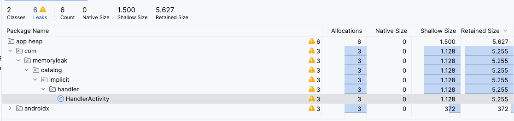

# Handler
A `Handler` is a fundamental Android component for scheduling work and dispatching actions to a thread's message queue. It's commonly used to perform tasks on the main thread from a background thread.

While powerful, `Handler` can easily lead to memory leaks if not used carefully, especially with delayed operations.

There are two main uses for a Handler:
1. Schedule messages and runnables to be executed at some point in the future.
2. Enqueue an action to be performed on a different thread than your own.

The main difference lies in the timing and order of execution:
* Scheduling tasks involves specifying when a task should run.
* Enqueuing tasks involves maintaining the order of execution.

|          | Scheduling                                                                     | Enqueuing                   |
|----------|--------------------------------------------------------------------------------|-----------------------------|
| Runnable | postAtTime(Runnable, long) <br/> postDelayed(Runnable, Object, long) | post(Runnable)              |
| Message  |                    sendMessageAtTime(Message, long)<br/> sendMessageDelayed(Message, long)                                                             |     sendEmptyMessage(int)<br/> sendMessage(Message)                        |


Handlers typically execute on the main/UI thread. They can be created as inner classes or anonymous classes.

## Handler Declaration Styles
**A Handler can be declared as an inner class, optionally with a Callback:**
```kotlin
// As a simple inner class property
private var innerHandler: Handler = Handler(Looper.getMainLooper())

// Or with a lambda, which creates a Callback under the hood
private val innerHandlerWithCallback: Handler = Handler(Looper.getMainLooper()) { msg: Message ->println(this@HandlerActivity) // Implicit reference to the outer Activity
    true
}
```

_**Bytecode**_
```java
 private final Handler innerHandler = new Handler(Looper.getMainLooper(), (Handler.Callback)(new Handler.Callback() {
      public final boolean handleMessage(@NotNull Message msg) {
         Intrinsics.checkNotNullParameter(msg, "msg");
         return true;
      }
   }));
```

**It can also be declared as an anonymous class override:**
```kotlin
 private val anonymousHandler: Handler = object : Handler(Looper.getMainLooper()) {
        override fun handleMessage(msg: Message) {
        }
    }
```
_**Bytecode**_
```java
 private final Handler anonymousHandler = (Handler)(new Handler(Looper.getMainLooper()) {
      public void handleMessage(@NotNull Message msg) {
         Intrinsics.checkNotNullParameter(msg, "msg");
      }
   });
```


## Memory leak
A memory leak can occur when a Handler is declared as a non-static inner class or an anonymous class.

Non-static inner and anonymous classes hold an implicit reference to their outer class (e.g., an Activity). If the Handler has a Message or Runnable in its message queue that outlives the Activity's lifecycle (e.g., a long-running task or a delayed message), the Garbage Collector cannot reclaim the Activity's memory. This creates a memory leak.Both inner classes and anonymous classes are susceptible to this leak for the same fundamental reason.

### Memory Leak Scenario
#### Inner Handler
###### Scheduling Runnable
```kotlin
    // This handler holds an implicit reference to its outer Activity.    
    private var innerHandler: Handler = Handler(Looper.getMainLooper())

    // A delayed Runnable is posted to the handler's message queue.
    // If the Activity is destroyed before the 50-second delay is over,
    // this Runnable still holds a reference to the Handler, which in turn
    // holds a reference to the destroyed Activity, preventing garbage collection.
    innerHandler.postDelayed({
        println(this@HandlerActivity)
    }, 50000)
```
###### Scheduling Message
```kotlin
     private val innerHandler: Handler = Handler(Looper.getMainLooper()) { msg: Message ->
        println(this@HandlerActivity)
        true
    }

    //Scheduling Message
    val message: Message = innerHandler.obtainMessage(1)
    innerHandler.sendMessageDelayed(message, 50000)
```
**The profile output:**


### Anonymous Handler
```kotlin
    private val anonymousHandler: Handler = object : Handler(Looper.getMainLooper()) {
        override fun handleMessage(msg: Message) {
            println(this@HandlerActivity)
        }
    }
```

###### Scheduling Runnable
```kotlin
    anonymousHandler.postDelayed({ 
        println(this@HandlerActivity) 
    }, 50000)
```
###### Scheduling Message
```kotlin
    val message: Message = anonymousHandler.obtainMessage(1)
    anonymousHandler.sendMessageDelayed(message, 50000)
```

A leak can also occur with enqueued tasks if they are long-running:
* `post(Runnable)`: If the Runnable performs a long-running task that extends beyond the Activity's lifecycle.
* `sendMessage(Message)`: If the Handler's message queue is blocked by many messages, and the Activity is closed before they are all processed.

## Fixing the Memory leak
There are two primary ways to fix this memory leak.

### Solution 1: Remove Callbacks in onDestroy
This is often the simplest solution. 
By calling `removeCallbacksAndMessages(null`), you clear all pending Runnables and Messages from the handler's queue when the Activity is destroyed. This breaks the reference chain causing the leak.


This approach is best when the tasks do not need to complete if the user leaves the screen.
```kotlin
    override fun onDestroy() {
        super.onDestroy()
        innerHandler.removeCallbacksAndMessages(null)
    }
```
### Solution 2: Use a Static Inner Class with a WeakReference

This solution is more robust and should be used when tasks must be allowed to complete.
1. **Make the `Handler` a `static` class:** This removes the implicit reference to the outer Activity.
2. **Pass a `WeakReference` to the Activity:** A WeakReference allows the Activity to be garbage collected while still providing access to it when it exists.

**_1. Define the Handler as a static inner class._**
```kotlin
    private class MyHandler(val activity: WeakReference<HandlerActivity>): Handler(Looper.getMainLooper()) {
        override fun handleMessage(msg: Message) {
            super.handleMessage(msg)
            // Get the activity. If it's null, it was garbage collected.
            val activity = activityReference.get()

            // Only proceed if the Activity is still alive and not finishing.
            if (activity == null || activity.isFinishing) {
                return // Activity is gone, so do nothing.
            }

            // Now it's safe to use the activity instance.
            println(activity)            
        }
    }
```

**_2. WeakReference_**
```kotlin
    // Scheduling a Runnable
    val activity = WeakReference(this)
    MyHandler(activity).postDelayed({
        println(activity.get())
    }, 50000)

    // Scheduling a Message
    val activity = WeakReference(this)
    val myHandler = MyHandler(activity)
    val message: Message = myHandler.obtainMessage(1)
    myHandler.sendMessageDelayed(message, 50000)
```


