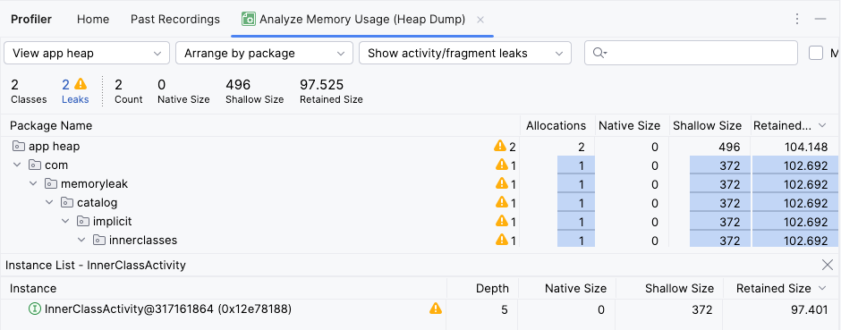

## Inner Classes

Is a non-static nested classes have all the features as a regular class plus they have full access  to the outer class.

Inner classes provide a way to encapsulate functionality within a single class, improving code organization and reducing complexity. 

They can also be used to implement callbacks, listeners, and other event-driven functionality.

### Memory leak
The inner class will cause memory leak because it has an implicit reference to its outer class 
and the outer class instance holds a reference to the inner class instance, 
then the inner class instance cannot be garbage collected even if it's no longer needed.

| Inner classs | Normal nested class | 
| --- | --- |
|  | | 


By default the nested classes in kotlin is static.
Tools > kotlin > Show kotlin byte code > Decompile

| Inner classs byte code | Normal nested class byte code| 
| --- | --- |
| | |

### Inner Class memory leak Example

### Example

- Create new activity and add inner class in it.
```Kotlin
    inner class InnerClass {
      fun printMessage() {
        println("Hello")
      }
    }
```
- Create static reference to inner class to create reference out of activity.
```Kotlin
    companion object {
        private lateinit var innerClass: InnerClass
    }
```
- Run the app and rotate the activity.
* Then check memory leak from profiler

| Old Android studio                                                                                                                                                                                                                                         | New Android studio                                                                                                                           | 
|------------------------------------------------------------------------------------------------------------------------------------------------------------------------------------------------------------------------------------------------------------|----------------------------------------------------------------------------------------------------------------------------------------------|
|    <br/>  Run “Force garbage collection” then select “Capture heap dump” and start record ||
* The heap dump output

##### To fix this Memory leak you need to use static inner class by delete `inner` keyword
```Kotlin
    class InnerClass {
    }
```