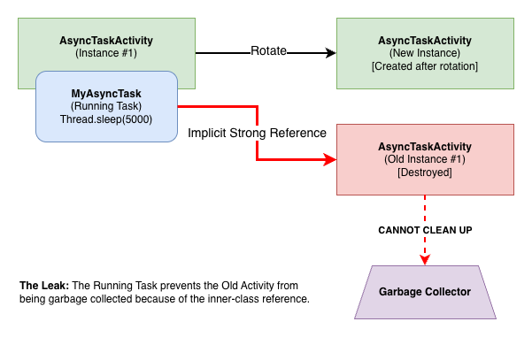

# AsyncTask
`AsyncTask` was a component designed to handle background operations and publish results on the UI thread without manual thread management.
`AsyncTask` was often implemented as an inner or anonymous class to easily access UI components.


**Note:** `AsyncTask` was deprecated in API level 30. For new development, it is highly recommended to use modern concurrency solutions like `Kotlin Coroutines`, `ViewModel`, and `LiveData`, which are more efficient and less prone to memory leaks.


## The Cause: Implicit References
A memory leak occurs because non-static inner and anonymous classes hold an implicit reference to their outer class (e.g., an `Activity` or `Fragment`).

If the `Activity` is destroyed (e.g., due to a screen rotation or the user navigating away) while the `AsyncTask` is still running its long background task, the Garbage Collector cannot reclaim the `Activity`'s memory because the `AsyncTask` still holds a strong reference to it.




## Leaky Code Examples
**Inner class:**
```kotlin
private inner class MyAsyncTask: AsyncTask<Void?, Void?, String>() {
    override fun doInBackground(vararg params: Void?): Void? {
        // Long-running work
        Thread.sleep(5000)
        return null
    }

    override fun onPostExecute(result: String) {
        // Implicit reference to the outer Activity
        this@AsyncTaskActivity
    }
}
```

**Anonymous class:**
```kotlin
object : AsyncTask<Void?, Void?, Void?>() {
   override fun doInBackground(vararg params: Void?): Void? {
       Thread.sleep(5000)
       return null
   }

   override fun onPostExecute(result: Void?) {
       super.onPostExecute(result)
       // This line will crash if the Activity was destroyed, but the leak
       // happens regardless because of the implicit reference.
       findViewById<TextView>(R.id.textView).text = "Task Finished!"
   }
}.execute()
```

### Detect the Memory Leak
1.  Run the app and rotate the activity.
2.  Click back to close the activity.
3.  Check for the leak in the Android Studio Profiler by capturing a heap dump.

**Memory leak output:**


## Fixing the Memory Leak

### Solution 1: Use a Static Inner Class with a WeakReference (Legacy)
This was the traditional way to solve the leak. It prevents a strong reference to the `Activity` but adds boilerplate code.

1.  **Make the `AsyncTask` a `static` inner class:** This removes the implicit reference.
2.  **Use a `WeakReference`:** Pass the `Activity` or `View` to the task inside a `WeakReference`, which allows it to be garbage collected.
3.  **Cancel the task:** In the `Activity`'s `onDestroy()` method, cancel the task to stop unnecessary work.

```kotlin
class AsyncTaskActivity : AppCompatActivity() {

    private lateinit var myAsyncTask: MyAsyncTask
    
    override fun onCreate(savedInstanceState: Bundle?) {
        super.onCreate(savedInstanceState)
        setContentView(R.layout.activity_async_task)

        myAsyncTask = MyAsyncTask(this).apply { execute() }
    }
    
    override fun onDestroy() {
        super.onDestroy()
        // Cancel the task to avoid performing work when the Activity is gone
        myAsyncTask?.cancel(true)
    }

    // Static inner class does not hold an implicit reference to the outer Activity
    private class MyAsyncTask(activity: AsyncTaskActivity): AsyncTask<Void?, Void?, String>() {
        // WeakReference allows the Activity to be garbage collected
        private val activityReference: WeakReference<AsyncTaskActivity> = WeakReference(activity)
    
        override fun doInBackground(vararg params: Void?): String {
            Thread.sleep(5000)
            return "Finished"
        }
    
        override fun onPostExecute(result: String) {
            // Only proceed if the Activity is still alive
            val activity = activityReference.get()
            if (activity == null || activity.isFinishing) {
                return
            }
            
            // Now it's safe to update the UI
            activity.findViewById<TextView>(R.id.textView).text = result
        }
    }
}
```

### Solution 2: Migrate to ViewModel and Coroutines (Recommended)
The modern and recommended approach is to use `ViewModel` with Kotlin Coroutines. This architecture-aware solution handles lifecycle events automatically, preventing memory leaks and simplifying code.

-   **`ViewModel`**: Survives configuration changes and holds UI-related data.
-   **`viewModelScope`**: A built-in `CoroutineScope` that is automatically cancelled when the `ViewModel` is cleared, preventing leaks.

```kotlin
class MyViewModel : ViewModel() {
    
    private val _result = MutableLiveData<String>()
    val result: LiveData<String> = _result

    fun doLongRunningWork() {
        // viewModelScope is automatically cancelled when the ViewModel is cleared
        viewModelScope.launch {
            // Run the long-running task on a background thread
            val workResult = withContext(Dispatchers.IO) {
                delay(5000)
                "Finished"
            }
            // Post the result to the main thread
            _result.value = workResult
        }
    }
}

// Observe the result in Activity
class AsyncTaskActivity : AppCompatActivity() {
    
    private val viewModel: MyViewModel by viewModels()

    override fun onCreate(savedInstanceState: Bundle?) {
        super.onCreate(savedInstanceState)
        setContentView(R.layout.activity_async_task)

        // Observe the LiveData for results
        viewModel.result.observe(this) { result ->
            findViewById<TextView>(R.id.textView).text = result
        }

        // Start the work
        viewModel.doLongRunningWork()
    }
}
```