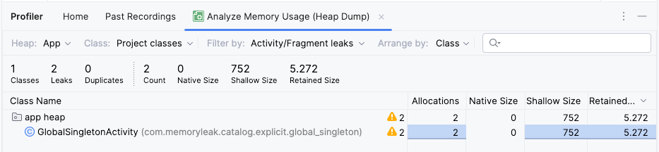
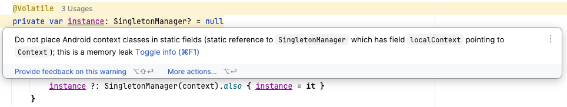

# Global Singleton
A singleton is a design pattern that ensures a class has only one instance and provides a global point of access to it. While useful, improper use of a singleton can lead to memory leaks.

If a singleton retains references to short-lived objects (Activity, Fragment, View) or improperly scoped resources, those objects cannot be garbage-collected.

Useful when you want a single point of control for actions coordinated across an application, such as:
* Managing resources
* Room database instance


## The Cause: Holding a Short-Lived Context

A singleton memory leak occurs when a singleton holds a reference to a short-lived `Context`, like an `Activity` or `View` context.  
When the activity is destroyed (e.g., on screen rotation or when the user navigates away), the garbage collector cannot reclaim the activity's memory because the singleton still holds a strong reference to it. The singleton itself lives as long as the application.

## Leaky Code Example

Here is an example of a singleton that can cause a memory leak by holding onto a `Context`.

```kotlin
class SingletonManager private constructor(context: Context) {

    private var localContext: Context? = context

    companion object {
        @Volatile
        private var instance: SingletonManager? = null

        fun getInstance(context: Context): SingletonManager {
            return instance ?: synchronized(this) {
                instance ?: SingletonManager(context).also { instance = it }
            }
        }
    }
}
```

When you pass an `Activity` context to `getInstance`, the `SingletonManager` will hold a reference to that `Activity`. If the `Activity` is destroyed, the `SingletonManager` will prevent it from being garbage collected.

### Detect the Memory Leak
1.  Run the app and rotate the activity.
2.  Click back to close the activity.
3.  Check for the leak in the Android Studio Profiler by capturing a heap dump.

**Memory leak from Profiler**


## Fixing the Memory Leak

### Solution 1: Use Application Context

Always use the application context with singletons. The application context is tied to the lifecycle of the application itself, not a specific activity, so it's safe to hold a reference to it in a long-lived object.

```kotlin
 companion object {
    @Volatile
    private var instance: SingletonManager? = null

    fun getInstance(context: Context): SingletonManager {
        return instance ?: synchronized(this) {
            // Use applicationContext to avoid leaking the Activity context
            instance ?: SingletonManager(context.applicationContext).also { instance = it }
        }
    }
}
```

For a database instance, you should also use the application context.

```kotlin
object DatabaseProvider {
    val db: AppDatabase by lazy {
        Room.databaseBuilder(
            appContext, // application context only
            AppDatabase::class.java,
            "app_db"
        ).build()
    }
}
```

### Solution 2: Use Weak References

If the singleton needs to hold a reference to a short-lived object, use a `WeakReference`. 

A `WeakReference` does not prevent the garbage collector from reclaiming the object's memory.

```kotlin
class SingletonManager private constructor(context: Context) {
    private val contextRef: WeakReference<Context> = WeakReference(context)
    // Safe usage of the context
}
```
Remember to check if the referenced object is `null` before using it.

### Solution 3: Manual Resource Management

If the singleton must hold resources tied to an activity's lifecycle, provide methods to release these resources when they are no longer needed.

In the Activity:
```kotlin
override fun onDestroy() {
    super.onDestroy()
    SingletonManager.getInstance(this).releaseResources()
}
```
In `SingletonManager`:
```kotlin
class SingletonManager private constructor(context: Context) {
    private var localContext: Context? = context

    fun releaseResources() {
        localContext = null
        // Release other resources, unregister listeners, etc.
    }
    
    // ...
}
```
This approach is more error-prone, as you must remember to call the `releaseResources` method in every `Activity` that uses the singleton.


> **Note:** By default, Android Studio will display a memory leak warning if you store a context in a singleton. 
> This warning can be addressed by clearing the context instance when it's no longer needed, as shown above.
> 
> 
