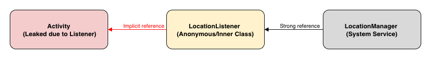
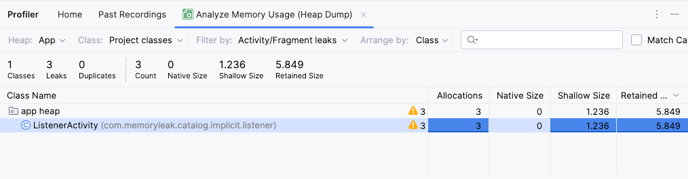

## Leaking Listener

Memory leaks can occur if listeners, particularly those registered with system services, are not unregistered when an `Activity` or `Fragment` is destroyed.

---

### The Cause: Implicit References and System Services

A common source of leaks is using listeners with system services like `LocationManager`. Here's the reference chain that causes the leak:

1. **System Service:** `LocationManager` is a system-level service outside your app's process and lifecycle.
2. **Listener Reference:** When you register a `LocationListener`, `LocationManager` holds a strong reference to it to deliver updates.
3. **Implicit Activity Reference:** If the `LocationListener` is an **anonymous or inner class** of an `Activity`, it implicitly holds a reference to that `Activity`.

**Reference chain:**


Because the system's `LocationManager` holds a reference to the listener, and the listener holds a reference to the `Activity`, the `Activity` cannot be garbage collected even after it's destroyed (e.g., on screen rotation or when the user navigates away).

### Leaky Code Example
The following `Activity` registers a `LocationListener` in `onResume()` but never unregisters it, causing a memory leak.

```kotlin

private const val LOCATION_REQUEST = 99
class ListenerActivity : AppCompatActivity() {
    private lateinit var locationManager: LocationManager
    private lateinit var locationListener: LocationListener

    override fun onCreate(savedInstanceState: Bundle?) {
        super.onCreate(savedInstanceState)
        setContentView(R.layout.activity_listener)

        locationManager = getSystemService(LOCATION_SERVICE) as LocationManager

        // The anonymous LocationListener class holds an implicit reference to ListenerActivity
        locationListener = object : LocationListener {
            override fun onLocationChanged(location: Location) {
                // Implicit reference to Activity
                this@ListenerActivity
            }
        }
    }

    override fun onResume() {
        super.onResume()
        initLocationUpdates()
    }
    private fun initLocationUpdates() {
        if (ActivityCompat.checkSelfPermission(
                this,
                Manifest.permission.ACCESS_FINE_LOCATION
            ) != PackageManager.PERMISSION_GRANTED && ActivityCompat.checkSelfPermission(
                this,
                Manifest.permission.ACCESS_COARSE_LOCATION
            ) != PackageManager.PERMISSION_GRANTED
        ) {
            ActivityCompat.requestPermissions(
                this, arrayOf(Manifest.permission.ACCESS_FINE_LOCATION), LOCATION_REQUEST
            )
        } else {
            requestLocationUpdates()
        }
    }

    override fun onRequestPermissionsResult(
        requestCode: Int,
        permissions: Array<out String>,
        grantResults: IntArray,
    ) {
        super.onRequestPermissionsResult(requestCode, permissions, grantResults)
        if (requestCode == LOCATION_REQUEST) {
            if (grantResults.isNotEmpty()
                && grantResults[0] == PackageManager.PERMISSION_GRANTED
            ) {
                requestLocationUpdates()
            }
        }
    }

    @SuppressLint("MissingPermission")
    private fun requestLocationUpdates() {
        // Register the location listener
        locationManager.requestLocationUpdates(
            LocationManager.GPS_PROVIDER,
            1000L,
            1f,
            locationListener
        )
    }
}
```

### Detect the Memory Leak
1.  Run the app and navigate to the `ListenerActivity`.
2.  Rotate the device several times to trigger `Activity` destruction and recreation.
3.  Use the Android Studio Profiler to capture a heap dump.
4.  Filter for `ListenerActivity` in the profiler.




### Fixing the Memory Leak
Unregister the listener when the `Activity` is no longer in the foreground. 

The correct place to do this is in `onPause()`, the counterpart to `onResume()`.

```kotlin
    override fun onPause() {
        super.onPause()
        // Unregister the listener to prevent leaks
        locationManager.removeUpdates(locationListener)
    }
```
By adding this method to the `ListenerActivity`, the `LocationManager` will release its reference to the `locationListener`, allowing both the listener and the `Activity` to be garbage collected properly.
