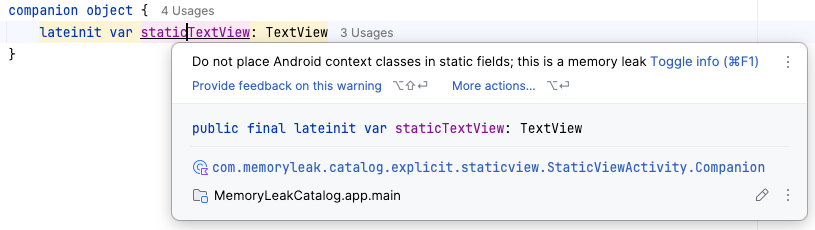
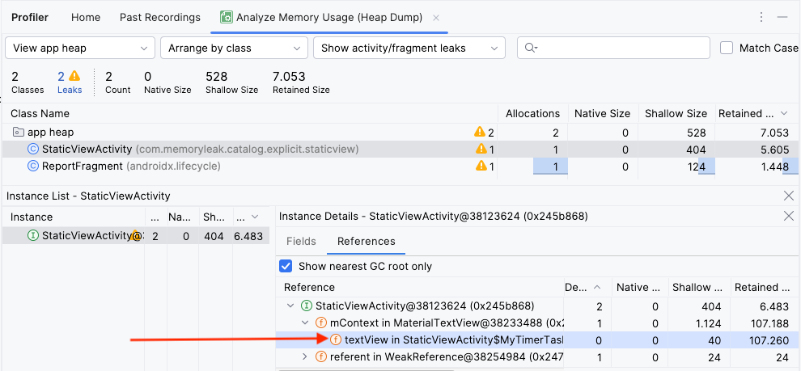

# Static View

Making static UI components, like TextViews, ImageViews, Buttons, and other widgets, is uncommon and often not recommended.

## The Cause: Static References

A **static UI components memory leak** can happen when static references to views or context objects are held in your code, preventing them from being garbage collected when they are no longer needed.

The most common source of static memory leaks is when you store a reference to a `TextView` inside a static field. This holds a reference to the entire view hierarchy and the `Activity` context.

| Kotlin static textView                                                              | Java textView                                       |
|-------------------------------------------------------------------------------------|-----------------------------------------------------|
| <br/> Android shows a warning  |  |

## Leaky Code Examples

**Example #1: Static TextView**
```kotlin
    override fun onCreate(savedInstanceState: Bundle?) {
        super.onCreate(savedInstanceState)

        staticTextView = TextView(this)
        staticTextView.text = " Static Text view...."
        setContentView(staticTextView)
    }

    companion object {
        lateinit var staticTextView: TextView
    }
```
---
**Example #2: Long-lived View References**

```kotlin
override fun onCreate(savedInstanceState: Bundle?) {
  super.onCreate(savedInstanceState)
  setContentView(R.layout.activity_static_view)

  val textView = findViewById<TextView>(R.id.txt_example)
  val weakActivity = WeakReference(this)
  val timer = Timer() 
    
    // The long-running TimerTask holds a strong reference to the TextView,
    // which in turn holds a reference to the Activity, causing a leak.
    // Without rotate the screen just passing the textView directly cause memory leak.
    timer.schedule(MyTimerTask(weakActivity, textView), 1000, 1000)
}

class MyTimerTask(private val activityReference: WeakReference<StaticViewActivity>, private val textView: TextView) :
  TimerTask() {
  override fun run() {
    val activity: StaticViewActivity? = activityReference.get()
    if (activity != null) {
      activity.runOnUiThread {
        textView.text = "Updated text .................."
      }
    } else {
      cancel()
    }
  }
}
```

### Detect the Memory Leak
1.  Run the app and rotate the activity.
2.  Click back to close the activity.
3.  Check for the leak in the Android Studio Profiler by capturing a heap dump.

**Memory leak output:**

<p align="center">
<kbd style="display:inline-block; padding:2px;">
  
</kbd>
</p>

_P.S. When fix the memory leak in timer it very import to identify the specific cause of the leak in the code. here the textview is the cause of the memory leak._

## Fixing the Memory Leak

### Solution 1: Avoid Static UI Components
The simplest solution is to avoid using static references for UI components altogether. If you need to share data or state, use a `ViewModel`.

### Solution 2: Use WeakReference
If you must hold a reference to a view in a long-running background task, use a `WeakReference`. This allows the Garbage Collector to reclaim the object's memory if it is no longer strongly referenced elsewhere.

```kotlin
    override fun onCreate(savedInstanceState: Bundle?) {
        super.onCreate(savedInstanceState)
        setContentView(R.layout.activity_static_view2)

        val textView = findViewById<TextView>(R.id.textView)
        val weakActivity = WeakReference(this)
        val timer = Timer()

        // Wrap the TextView in a WeakReference to prevent the leak
        timer.schedule(MyTimerTask(weakActivity, WeakReference(textView)), 1000, 1000)
    }

    class MyTimerTask(private val activityReference: WeakReference<StaticViewActivity2>, private val textView: WeakReference<TextView>) :
        TimerTask() {
        override fun run() {
            val activity: StaticViewActivity2? = activityReference.get()
            val textViewRef: TextView? = textView.get()

            if (activity != null && textViewRef != null) {
                activity.runOnUiThread {
                    textViewRef.text = "Updated text .................."
                }
                println(activity)
            } else {
                cancel()
            }
        }
    }
```
For more information about timer memory leak you can check the following link:
