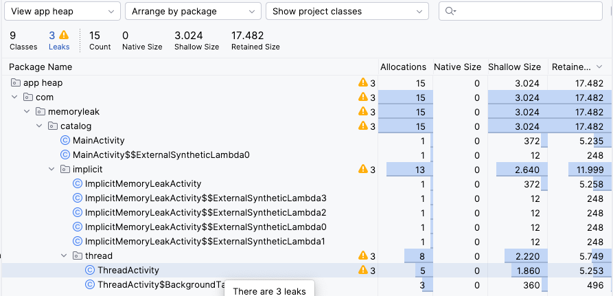

# Thread / Runnable

In Android, any time-consuming operation must be run on a background thread to avoid blocking the main (UI) thread.

There are two primary ways to create a new thread of execution:
*   **Subclass `Thread`:** Declare a class that extends `Thread` and overrides its `run()` method.
*   **Implement `Runnable`:** Declare a class that implements the `Runnable` interface and pass an instance of it to a `Thread`'s constructor. This is often preferred as it allows a class to extend other classes while also being runnable.

However, if not managed carefully, background threads can cause memory leaks.

## Leaky Code Examples

Both of the following examples will leak the `ThreadActivity` because the running thread holds an implicit reference to it.

### Example 1: Inner Class

The `BackgroundTask` is an `inner` class, so it implicitly references `ThreadActivity`.

```kotlin
class ThreadActivity : AppCompatActivity() {
    override fun onCreate(savedInstanceState: Bundle?) {
        super.onCreate(savedInstanceState)
        // The thread is created as an inner class and started.
        // It now has an implicit reference to ThreadActivity.
        BackgroundTask().start()
    }

    // Bad: Inner class holds an implicit reference to ThreadActivity.
    private inner class BackgroundTask : Thread() {
        override fun run() {
            try {
                sleep(20000) // Simulate a long-running task.
            } catch (e: InterruptedException) {
                e.printStackTrace()
            }
        }
    }
}
```

### Example 2: Anonymous Class

The anonymous `Thread` object behaves like an inner class and also holds an implicit reference.

```kotlin
class ThreadActivity : AppCompatActivity() {
    override fun onCreate(savedInstanceState: Bundle?) {
        super.onCreate(savedInstanceState)

        // Bad: The anonymous class holds an implicit reference to ThreadActivity.
        object : Thread() {
            override fun run() {
                try {
                    sleep(20000)
                    // The implicit reference exists even if `this@ThreadActivity` isn't used.
                    this@ThreadActivity
                } catch (e: InterruptedException) {
                    e.printStackTrace()
                }
            }
        }.start()
    }
}
```

### Detect the memory leak
- Run the app and rotate the activity.
- Click back to close the activity.
- Then check memory leak from profiler
- Select “Capture heap dump” and start record
  


## Fixing the Leak:

To fix this leak, you must do two things:

1.  **Break the implicit reference:** Convert the thread into a `static` nested class. Static classes do **not** hold an implicit reference to their outer class.
2.  **Manage the thread's lifecycle:** Keep a reference to the thread and interrupt it when the `Activity` is destroyed. This ensures the thread doesn't continue running unnecessarily.

### Fixed Code Example

This single solution works for both inner and anonymous class leaks.

```kotlin
class ThreadActivity : AppCompatActivity() {

    private lateinit var myThread: Thread

    override fun onCreate(savedInstanceState: Bundle?) {
        super.onCreate(savedInstanceState)

        // Create and start the static nested class.
        myThread = BackgroundTask()
        myThread.start()
    }

    // Good: Static class does not hold an implicit reference to the Activity.
    private class BackgroundTask : Thread() {
        override fun run() {
            try {
                sleep(20000)
            } catch (e: InterruptedException) {
                // The thread was interrupted, which is expected.
                // The thread can now terminate gracefully.
                e.printStackTrace()
            }
        }
    }

    override fun onDestroy() {
        super.onDestroy()
        // Crucial: Interrupt the thread when the Activity is destroyed.
        myThread.interrupt()
    }
}
```
