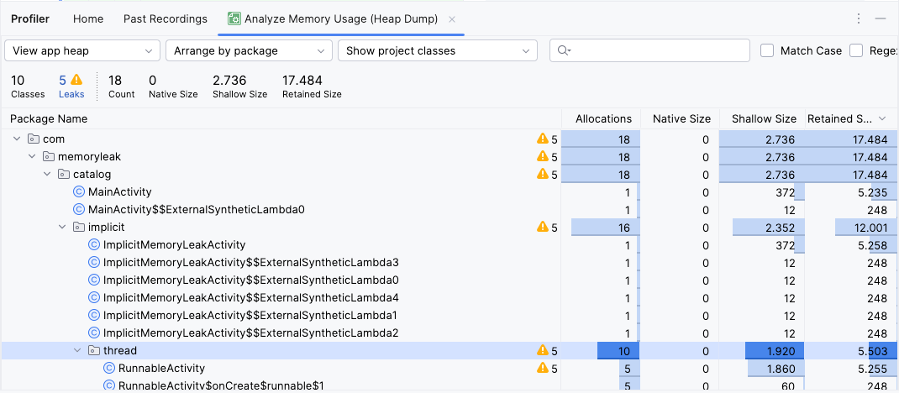

# Thread and Runnable

In Android, any time-consuming operation must be run on a background thread to avoid blocking the main (UI) thread.

There are two primary ways to create a new thread of execution:
*   **Subclass `Thread`:** Declare a class that extends `Thread` and overrides its `run()` method.
*   **Implement `Runnable`:** Declare a class that implements the `Runnable` interface and pass an instance of it to a `Thread`'s constructor. This is often preferred as it allows a class to implement multiple interfaces, whereas it can only extend one parent class.

However, if not managed carefully, both approaches can cause memory leaks.

## The Cause: Implicit References

A memory leak occurs when a background thread, created using a **non-static inner class** or an **anonymous class**, outlives the `Activity` or `Fragment` that created it.

Because these classes are not `static`, they hold an **implicit reference** to their outer class. If the `Activity` is destroyed (e.g., on screen rotation) while the thread is still running, the garbage collector cannot reclaim the `Activity`'s memory because the running thread still holds a reference to it.

## Leaky Code Examples

### Leaks with `Thread` Subclasses

**Example 1: Inner `Thread` Class**

```kotlin
class ThreadActivity : AppCompatActivity() {
    override fun onCreate(savedInstanceState: Bundle?) {
        super.onCreate(savedInstanceState)
        // The inner class instance holds a reference to the Activity.
        BackgroundTask().start()
    }

    // Bad: Inner class holds an implicit reference to ThreadActivity.
    private inner class BackgroundTask : Thread() {
        override fun run() {
            try {
                sleep(20000) // Simulate a long-running task.
            } catch (e: InterruptedException) {
                e.printStackTrace()
            }
        }
    }
}
```

**Example 2: Anonymous `Thread` Class**

```kotlin
class ThreadActivity : AppCompatActivity() {
    override fun onCreate(savedInstanceState: Bundle?) {
        super.onCreate(savedInstanceState)

        // Bad: The anonymous class holds an implicit reference to ThreadActivity.
        object : Thread() {
            override fun run() {
                try {
                    sleep(20000)
                    // The implicit reference exists even if `this@ThreadActivity` isn't used.
                    this@ThreadActivity
                } catch (e: InterruptedException) {
                    e.printStackTrace()
                }
            }
        }.start()
    }
}
```

### Leaks with `Runnable` Implementations

The same leak occurs when a `Runnable` is defined as an inner or anonymous class.

**Example 3: Inner `Runnable` Class**

```kotlin
class ThreadActivity : AppCompatActivity() {
    override fun onCreate(savedInstanceState: Bundle?) {
        super.onCreate(savedInstanceState)
        val runnable = MyRunnable() // Inner class holds a reference.
        Thread(runnable).start()
    }

    // Bad: Inner class holds an implicit reference to ThreadActivity.
    private inner class MyRunnable : Runnable {
        override fun run() {
            try {
                Thread.sleep(20000)
            } catch (e: InterruptedException) {
                e.printStackTrace()
            }
        }
    }
}
```

**Example 4: Anonymous `Runnable` Class**

```kotlin
class ThreadActivity : AppCompatActivity() {
    override fun onCreate(savedInstanceState: Bundle?) {
        super.onCreate(savedInstanceState)

        // Bad: Anonymous Runnable holds an implicit reference.
        val runnable = object : Runnable {
            override fun run() {
                try {
                    Thread.sleep(20000)
                    this@RunnableActivity
                } catch (e: InterruptedException) {
                    e.printStackTrace()
                }
            }
        }
        Thread(runnable).start()
    }
}
```

### Detect the Memory Leak
1.  Run the app and rotate the activity.
2.  Click back to close the activity.
3.  Check for the leak in the Android Studio Profiler by capturing a heap dump.

**Memory leak output for Example 1: Inner `Thread` Class**


**Memory leak output for Example 4: Anonymous `Runnable` Class**


## Fixing the Leak:

To fix this leak, you must do two things, regardless of whether you use `Thread` or `Runnable`:

1.  **Break the implicit reference:** Convert the `Thread` or `Runnable` class into a **`static` nested class**. Static classes do **not** hold an implicit reference to their outer class.
2.  **Manage the thread's lifecycle:** Keep a reference to the `Thread` instance and interrupt it when the `Activity` is destroyed. This ensures the thread doesn't continue running unnecessarily.

### Fixed Code Example

This single solution works for all the leaky examples above.

```kotlin
class ThreadActivity : AppCompatActivity() {

    private lateinit var myThread: Thread

    override fun onCreate(savedInstanceState: Bundle?) {
        super.onCreate(savedInstanceState)

        // Create and start the thread with a static nested class.
        myThread = Thread(BackgroundTask())
        myThread.start()
    }

    // Good: Static class does not hold an implicit reference to the Activity.
//    private class BackgroundTask : Runnable {
//        override fun run() {
//            try {
//                Thread.sleep(20000)
//            } catch (e: InterruptedException) {
//                // The thread was interrupted, which is expected.
//                // The thread can now terminate gracefully.
//                e.printStackTrace()
//            }
//        }
//    }

    // Good: Static class does not hold an implicit reference to the Activity.
    private class BackgroundTask : Thread() {
        override fun run() {
            try {
                sleep(20000)
            } catch (e: InterruptedException) {
                // The thread was interrupted, which is expected.
                // The thread can now terminate gracefully.
                e.printStackTrace()
            }
        }
    }

    override fun onDestroy() {
        super.onDestroy()
        // Interrupt the thread when the Activity is destroyed.
        myThread.interrupt()
    }
}
```

## References

-   [Android Developer: `Thread`](https://developer.android.com/reference/java/lang/Thread)
-   [Android Developer: `Runnable`](https://developer.android.com/reference/kotlin/java/lang/Runnable)
