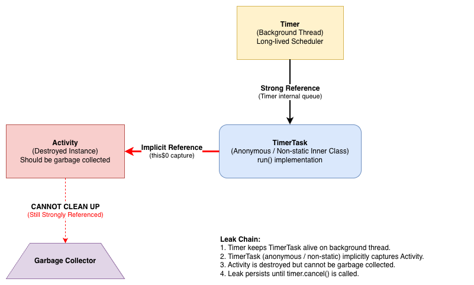
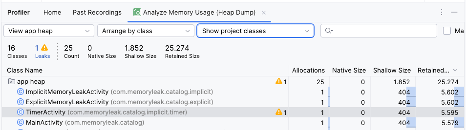

# Timer and TimerTask

**Timer** is a utility class for scheduling tasks on a background thread, while **TimerTask** represents the task to be executed. They are legacy Java APIs and are not lifecycle-aware, making them a common source of memory leaks in Android if not managed carefully.

The key difference is that `Timer` is the scheduler, and `TimerTask` is the task. You create a `TimerTask` and use a `Timer` to schedule it for execution.

## The Cause: Implicit References
A memory leak can occur when a `TimerTask` is an anonymous or non-static inner class in an `Activity` or `Fragment`. Such an inner class holds an implicit reference to its outer class.

If the `Activity` is destroyed (e.g., on screen rotation) while the `Timer` still holds a reference to the `TimerTask`, the Garbage Collector cannot reclaim the `Activity`'s memory. The `TimerTask` has a strong reference to the `Activity`, and the `Timer` (on a background thread) keeps the `TimerTask` alive.



## Leaky Code Example
**TimerTask as Anonymous class:**

```kotlin
class TimerActivity : AppCompatActivity() {

    private lateinit var timer: Timer

    override fun onCreate(savedInstanceState: Bundle?) {
        super.onCreate(savedInstanceState)
        setContentView(R.layout.activity_timer)
        
        timer = Timer()
        timer.schedule(object : TimerTask() {
            override fun run() {
                // Even an empty implementation can cause a leak.
                // The reference exists whether it's used or not.
                runOnUiThread {
                }
            }
        }, 1000, 1000)
    }
}
```

### Detect the Memory Leak
1.  Run the app and go to the `TimerActivity`.
2.  Rotate the device to trigger an `TimerActivity` recreation.
3.  Click back button to exit the `TimerActivity`.
3.  Capture a heap dump using the Android Studio Profiler.
4.  You will find that old instances of `TimerActivity` are not being garbage collected.

**Memory leak output:**



## Fixing the Memory Leak

### Solution 1: Cancel the Timer in onDestroy()
The simplest fix is to ensure the `Timer` is cancelled when the `Activity` is destroyed.

```kotlin
override fun onDestroy() {
    super.onDestroy()
    timer.cancel()
    timer.purge() // Removes all cancelled tasks from the timer's queue.
}
```
However, this is not a complete solution for configuration changes. The correct approach is to handle the lifecycle properly, as a new `Timer` will be created for the new `Activity` instance.

### Solution 2: Use a Static Inner Class with a WeakReference
This approach avoids the implicit reference.

1.  **Make `TimerTask` a `static` inner class:** This removes the strong implicit reference.
2.  **Use a `WeakReference`:** Pass the `Activity` to the `TimerTask` in a `WeakReference` to allow the `Activity` to be garbage collected.
3.  **Cancel the task from within:** The task should cancel itself if the `Activity` is no longer available.

```kotlin
class TimerActivity : AppCompatActivity() {

    private val timer = Timer()

    override fun onCreate(savedInstanceState: Bundle?) {
        super.onCreate(savedInstanceState)
        setContentView(R.layout.activity_timer)

        timer.schedule(MyTimerTask(this), 1000, 1000)
    }

    // Custom static inner class for the TimerTask
    private class MyTimerTask(activity: TimerActivity) : TimerTask() {
        private val activityReference: WeakReference<TimerActivity> = WeakReference(activity)

        override fun run() {
            val activity = activityReference.get()
            if (activity == null || activity.isFinishing) {
                cancel() // Activity is gone, so cancel the task
                return
            }

            // It's now safe to interact with the activity
            activity.runOnUiThread {
                // Update UI or perform other tasks
            }
        }
    }
    
    override fun onDestroy() {
        super.onDestroy()
        timer.cancel()
        timer.purge()
    }
}
```

### Solution 3: Use `Handler` or Coroutines (Recommended)
For UI-related tasks, `Handler` or Kotlin Coroutines are better and safer alternative to `Timer`/`TimerTask`.

-   **`Handler`**: Can post `Runnable` tasks to be executed on the UI thread's message queue, with delays or at specific times. It's lifecycle-aware when used correctly.
-   **Kotlin Coroutines with `lifecycleScope`**: This is the modern, recommended approach. It is structured, lifecycle-aware, and less prone to errors.

**Example using Coroutines:**
```kotlin
class TimerActivity : AppCompatActivity() {
    override fun onCreate(savedInstanceState: Bundle?) {
        super.onCreate(savedInstanceState)
        setContentView(R.layout.activity_timer)

        // This coroutine is automatically cancelled when the Activity is destroyed.
        lifecycleScope.launch {
            while (true) {
                delay(1000)
                // This code runs on the main thread, safe for UI updates.
                Log.d("TimerActivity", "Coroutine task running")
            }
        }
    }
}
```
The `lifecycleScope` automatically cancels the coroutine when the `Activity` is destroyed, preventing memory leaks.


## Explicit Memory Leak with TimerTask
A `TimerTask` can also cause an explicit memory leak if you pass an `Activity` or `Context` as a direct, strong reference.

```kotlin
// This TimerTask holds a strong reference to the Activity
class MyTimerTask(val activity: TimerActivity) : TimerTask() {
    override fun run() {
        // ...
    }
}

class TimerActivity : AppCompatActivity() {
    override fun onCreate(savedInstanceState: Bundle?) {
        super.onCreate(savedInstanceState)
        val timer = Timer()
        
        // The MyTimerTask instance now holds a strong reference to this Activity
        timer.schedule(MyTimerTask(this), 1000) 
    }
    // Forgetting to cancel the timer will cause a leak
}
```
In this case, `MyTimerTask` has a strong reference to `TimerActivity`. If the `Timer` is not cancelled in `onDestroy()`, it will keep the `MyTimerTask` alive, which in turn will keep the `TimerActivity` from being garbage collected.
